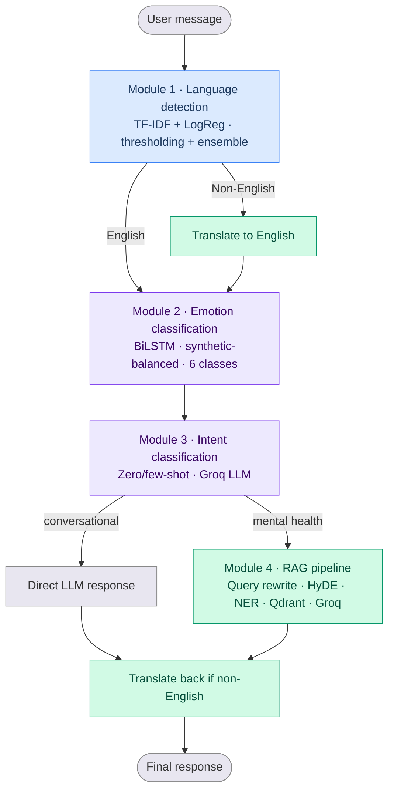
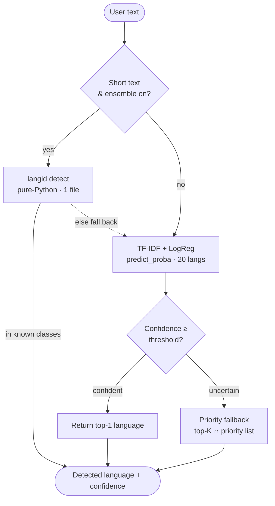
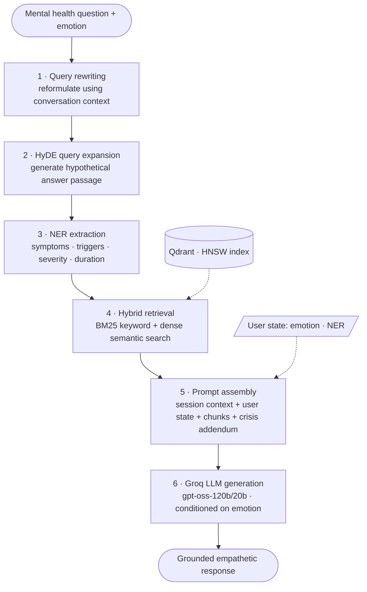
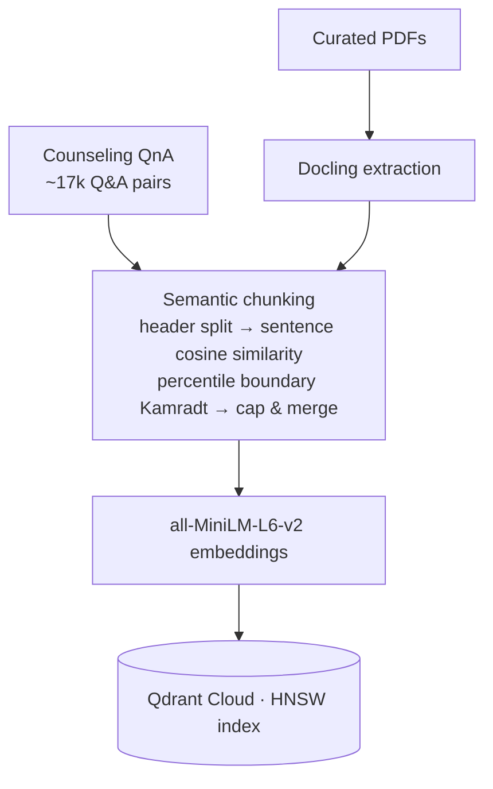
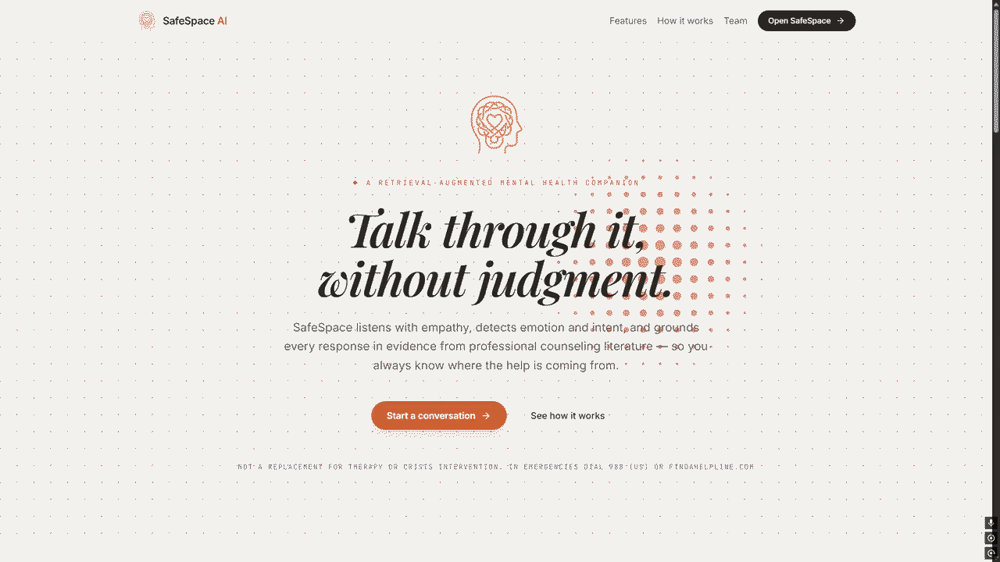

<div align="center">

# 🧠 SafeSpace AI

**RAG-Based Mental Health Support Chatbot** — NLP Final Project

*Empathetic, grounded, context-aware support for anxiety, depression, stress, and related topics — in the user's own language.*


[Overview](#-project-overview) · [Architecture](#-system-architecture) · [Modules](#-module-details) · [Setup](#-setup-and-usage) · [API](#-api-reference)

</div>

---

> [!WARNING]
> **SafeSpace AI is not a substitute for professional mental health care.** Responses are AI-generated from training data, not from licensed professionals. Always direct users in genuine distress to qualified professionals or crisis resources.

---

## 📦 Repositories

| Component | Repository |
|-----------|------------|
| 🤖 AI + FastAPI Backend | https://github.com/3omdawy11/SafeSpaceAI |
| 💻 React Frontend | https://github.com/ZeyadMahmoudAmrMohamed/SafeSpaceAI |

The backend contains the full NLP pipeline, RAG engine, REST API, and all four module implementations. The frontend provides a conversational UI that connects to the FastAPI backend in real time.

---

## 🎯 Project Overview

SafeSpace AI integrates four distinct NLP modules into a single, tightly coupled pipeline. A user message flows through language detection, emotion classification, and intent routing before reaching the RAG engine, which retrieves relevant mental health knowledge and generates a final response — all returned in the user's original language.

---

## 🏗 System Architecture

A user message passes through language detection, optional translation, emotion classification, and intent routing. Conversational turns get a direct reply; mental health questions trigger the full RAG pipeline. The response is translated back to the original language before delivery.



<details>
<summary><b>🔎 Module 1 — Language detection internals</b></summary>

<br/>

Short text with the ensemble enabled is checked first by `langid`; otherwise the TF-IDF logistic regression model runs. When the model's confidence falls below threshold, the system walks the top-K predictions and returns the highest-priority language instead of defaulting blindly to the top softmax output. If `langid` returns a language outside the model's known classes, it falls back to the thresholded model path.



</details>

<details>
<summary><b>🔎 Module 4 — RAG pipeline (expanded)</b></summary>

<br/>

The core of the project. Query rewriting cleans the raw question first; HyDE and NER both build on the rewritten query to shape what hybrid retrieval searches for. Prompt assembly is its own stage because the final prompt pulls from three places — retrieved chunks, the live user state from Modules 2–4, and a conditional crisis addendum — before Groq generates the grounded response.



</details>

<details>
<summary><b>🔎 Offline knowledge-base indexing</b></summary>

<br/>

The build-time pipeline that populates Qdrant. Curated PDFs are parsed with Docling, then both the PDFs and the counseling Q&A dataset are semantically chunked, embedded, and indexed. This runs once during setup, separate from the per-request runtime flow.



</details>

---

## 🚀 Quick Start

```bash
git clone https://github.com/3omdawy11/SafeSpaceAI
cd SafeSpaceAI && cp .env.example .env   # then fill in your keys
pip install -r requirements.txt
uvicorn app.main:app --reload
```

Then open **http://localhost:8000/docs** for the interactive API.

> 💡 **Tip:** record a short demo and drop it in `assets/demo.gif`, then embed it here — a 15-second clip is the single highest-impact addition to any README:
> ```markdown
> <div align="center"></div>
> ```

---

## 🧩 Module Details

### Module 1 · Language Detection

A traditional NLP multi-class classifier that identifies the language of an incoming user query across 20 languages. This module gates the translation step and ensures all downstream modules operate on English text.

| Property | Detail |
|----------|--------|
| Dataset | Language Identification Dataset (~90k samples, HuggingFace) |
| Vectorization | TF-IDF on character n-grams |
| Classifier | Logistic Regression |
| Output | Detected language code (e.g. `en`, `ar`) + confidence score |

**Probability thresholding.** When the model's top prediction falls below `CONFIDENCE_THRESHOLD`, the system scans the top-K predicted languages and returns the first one found in `LANGUAGE_PRIORITY` (ordered by approximate global speaker population and web prevalence). This prevents rare or visually-similar languages from "winning" on short, ambiguous text like `"hi"`.

**Short-text ensemble (optional).** When `USE_SHORT_TEXT_ENSEMBLE` is enabled, texts shorter than `SHORT_TEXT_THRESHOLD` characters are first passed to `langid` (lightweight, pure-Python, single file). If `langid`'s result is in the model's known classes it is used directly; otherwise the system falls back to the thresholded model prediction. Toggle off via `LANG_DETECTOR_ENSEMBLE=0` for zero import cost.

Non-English queries are translated to English before continuing, and the final response is translated back to the original language before delivery.

---

### Module 2 · Emotion Classification

A deep learning multi-class classifier that identifies the emotional state expressed in the user's query. The detected emotion directly shapes how the RAG module frames its final response, enabling empathetic and tone-appropriate replies.

| Property | Detail |
|----------|--------|
| Base Dataset | Emotion Dataset (~6k Twitter messages, HuggingFace) |
| Model | BiLSTM, fine-tuned on Kaggle GPU |
| Classes | joy, sadness, anger, fear, love, surprise |
| Output | Emotion label |

**Handling class imbalance with synthetic data generation.** The original dataset was heavily skewed toward joy and sadness. To address this, we synthesized an additional 16,112 entries using `llama-3.3-70b-versatile`, targeting the underrepresented classes until every class reached parity:

| Emotion | Original | Synthetic | Total |
|---------|---------:|----------:|------:|
| joy | 5,286 | 0 | 5,286 |
| sadness | 4,512 | 774 | 5,286 |
| anger | 2,108 | 3,178 | 5,286 |
| fear | 1,850 | 3,436 | 5,286 |
| love | 1,291 | 3,995 | 5,286 |
| surprise | 557 | 4,729 | 5,286 |

---

### Module 3 · Intent Classification

Classifies the user's intent into one of five categories and routes the system to the correct response path — without any additional model training. This avoids unnecessary RAG calls for simple conversational turns.

| Property | Detail |
|----------|--------|
| Method | Zero-shot / few-shot prompting via Groq LLM |
| Classes | `greeting`, `goodbye`, `gratitude`, `asking_mental_health_question`, `out_of_scope` |

**Routing logic:**
- `greeting`, `goodbye`, `gratitude` → direct LLM response, no RAG invoked
- `asking_mental_health_question` → triggers the full RAG pipeline
- `out_of_scope` → polite decline with redirection

---

### Module 4 · RAG Pipeline

The core knowledge-retrieval and generation module. When a query is classified as a mental health question, this pipeline retrieves the most relevant passages from the knowledge base and synthesizes a grounded, empathetic response conditioned on both the retrieved chunks and the detected emotion from Module 2.

| Property | Detail |
|----------|--------|
| Dataset | Mental Health Counseling Conversations (~17k Q&A pairs, HuggingFace) + curated domain PDFs |
| Embeddings | `all-MiniLM-L6-v2` (Sentence Transformers) |
| Vector DB | Qdrant Cloud (HNSW indexing) |
| LLM | Groq free tier (`gpt-oss-120b` / `gpt-oss-20b`) |

The pipeline runs the following stages in order (see the [expanded diagram](#-system-architecture) above):

**1 · Query rewriting.** The raw question is reformulated using conversation context so retrieval works on a clean, self-contained query.

**2 · HyDE query expansion.** A Hypothetical Document Embedding — a synthetic passage that a relevant answer might look like — is generated and used alongside the rewritten query to improve recall for abstractly-phrased questions.

**3 · NER extraction.** Named entity recognition identifies symptoms, triggers, severity signals, and mentioned duration, refining both retrieval and response generation.

**4 · Hybrid search.** Retrieval combines BM25 keyword search with dense semantic similarity over Qdrant, surfacing both exact-term matches and conceptually related passages.

**5 · Prompt assembly.** The final prompt combines session context, live user state (emotion + NER), the retrieved chunks, and a conditional crisis addendum.

**6 · Groq LLM generation.** The response is generated and conditioned on the detected emotion for tone-appropriate, empathetic replies.

<details>
<summary><b>📄 Knowledge-base ingestion: PDF extraction + semantic chunking</b></summary>

<br/>

**PDF extraction with Docling.** Curated mental health PDFs are parsed using Docling, which handles complex layouts, multi-column text, and embedded structure more reliably than basic text extractors.

**Semantic chunking.** Both the PDFs and the counseling Q&A dataset are chunked by true semantic similarity rather than fixed token windows:

1. Split each document on markdown headers (`##`, `###`, …) to keep structural boundaries intact and preserve section context.
2. Sentence-tokenise each section and compute cosine similarity between every consecutive sentence pair.
3. Insert a chunk boundary wherever similarity drops below a configurable percentile threshold (Kamradt percentile method).
4. Hard-cap any chunk exceeding `max_section_chars` at the nearest sentence boundary, then merge orphan chunks shorter than `min_chunk_chars`.
5. Use the embedding model to embed sentences when provided; otherwise fall back to TF-IDF vectors (no external dependencies required).

This preserves meaning across chunk boundaries and improves retrieval precision.

</details>

---

## 🛠 Technology Stack

| Layer | Technology |
|-------|-----------|
| Language |  |
| API server |   |
| Frontend |  |
| Deep learning |  |
| Models & data |   |
| Vector DB |  |
| LLM inference |  |
| Classic ML |  |
| Experiment tracking |  |
| PDF extraction |  |
| Data |   |

---

## 📚 Datasets

| Dataset | Size | Type | Source |
|---------|------|------|--------|
| Language Identification | ~90,000 samples | 20 languages | HuggingFace (auto-downloaded) |
| Emotion Detection | ~6,000 original + 16,112 synthetic | 6 emotion classes | HuggingFace (Twitter messages) |
| Mental Health Counseling | ~17,000 Q&A pairs | Professional counseling | HuggingFace — core RAG knowledge |
| Mental Health PDFs | Custom | Curated books and guides | Manually placed in `data/raw/` |

---

## ⚙️ Setup and Usage

### Environment Variables

Create a `.env` file in the project root:

```bash
GROQ_API_KEY       # https://console.groq.com/
QDRANT_URL         # https://cloud.qdrant.io/
QDRANT_API_KEY     # Generated from Qdrant dashboard
WANDB_API_KEY      # wandb login locally, or set in Kaggle secrets
```

### Running the Pipeline

Run the following from the backend repository root, in order:

```bash
# 1. Install dependencies
pip install -r requirements.txt
```
```bash
# 2. Download datasets and chunk PDFs
python scripts/00_prepare_data.py
```
```bash
# 3. Train the TF-IDF language detector
python scripts/01_train_language_detector.py
```
```bash
# 4. Index the knowledge base to Qdrant
python scripts/03_setup_rag.py
```
```bash
# 5. Start the FastAPI server on localhost:8000
uvicorn app.main:app --reload
```
```bash
# 6. Run full pipeline smoke tests
python scripts/04_test_pipeline.py
```

---

## 🔌 API Reference

### `POST /chat`

Main inference endpoint. Accepts a user message and returns a full pipeline response.

**Response fields:**

| Field | Description |
|-------|-------------|
| `response` | Generated text response (translated back to original language if needed) |
| `emotion` | Detected emotion label (e.g. `fear`, `sadness`) |
| `language` | Detected language code (e.g. `en`, `ar`) |
| `intent` | Classified intent (e.g. `asking_mental_health_question`) |
| `confidence_scores` | Per-module confidence values (language, emotion, intent) |
| `sources` | Retrieved knowledge chunks with source attribution |

---

## ⚠️ Limitations

- **Not a therapist.** Responses are AI-generated from training data, not from licensed mental health professionals. Users in genuine distress should always be directed to real professional resources.
- **Knowledge base bounds.** RAG output quality is directly bounded by the quality and coverage of the indexed PDFs and counseling dataset.
- **English-biased training.** The emotion classifier and LLM are trained and prompted primarily in English. Translation quality for low-resource languages may vary.
- **No persistent user state.** This is a proof-of-concept; there is no cross-session conversation history or user profile.
- **API rate limits.** The free Groq tier (~30 requests/min) is sufficient for development but not for production workloads.

---

## 🔭 Future Work

- Expand the knowledge base with additional peer-reviewed mental health resources and clinical guidelines.
- Fine-tune the LLM on domain-specific mental health data for more nuanced responses.
- Implement persistent conversation history and user context across sessions.
- Extend multi-language support end-to-end, including multilingual emotion classification.
- Integrate a feedback-driven fine-tuning loop using collected user ratings.

---

## 👥 Team

| Mohamed Emad | Ziad Mahmoud |
|:---:|:---:|
| [](https://github.com/3omdawy11) | [](https://github.com/ZeyadMahmoudAmrMohamed) |

<div align="center">
<br/>
<sub>Built as an NLP course capstone · SafeSpace AI</sub>
</div>
